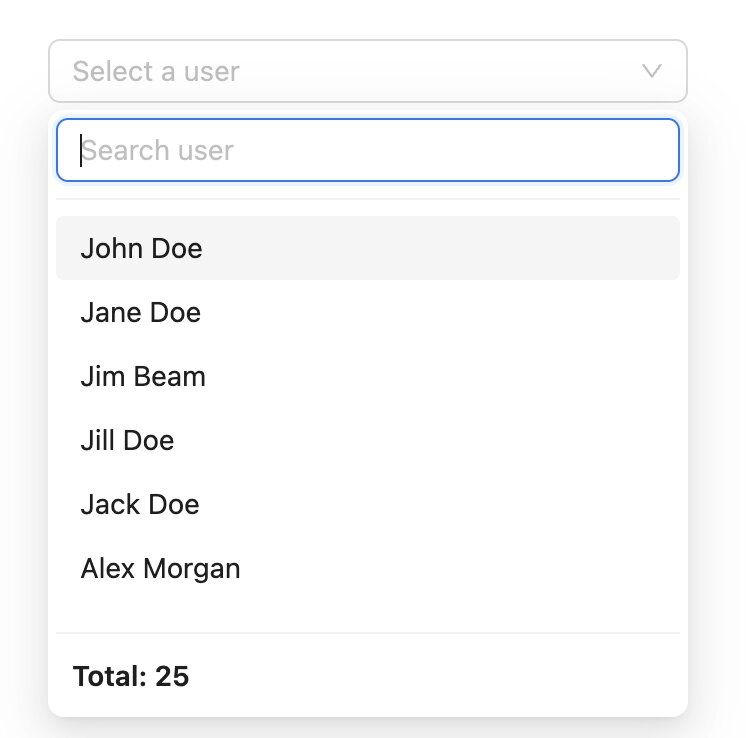
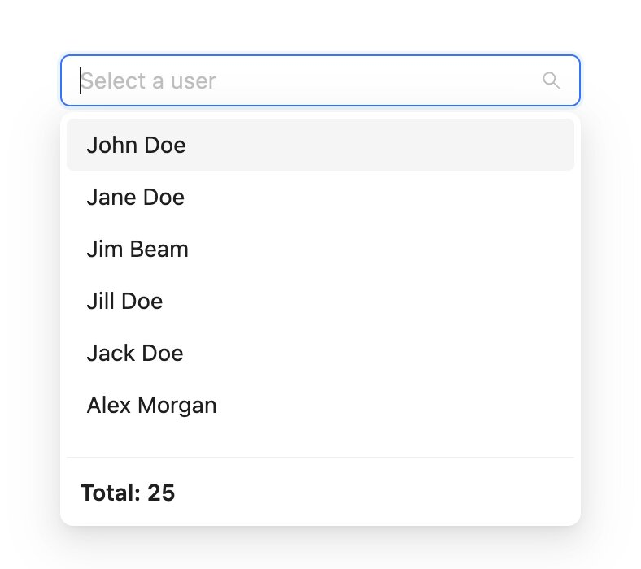
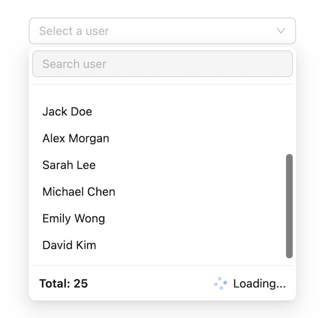
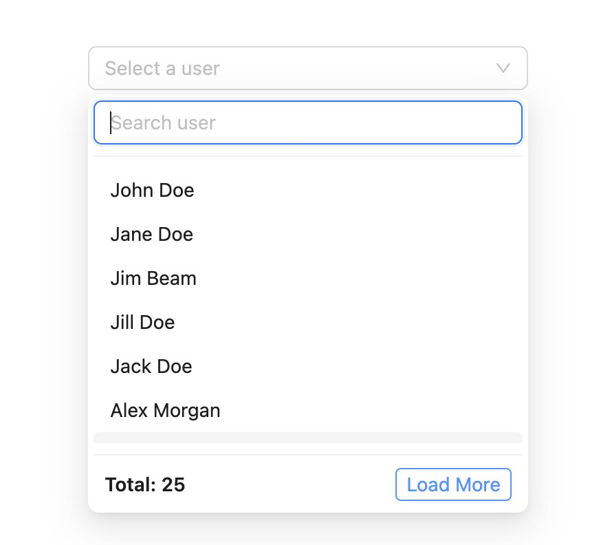
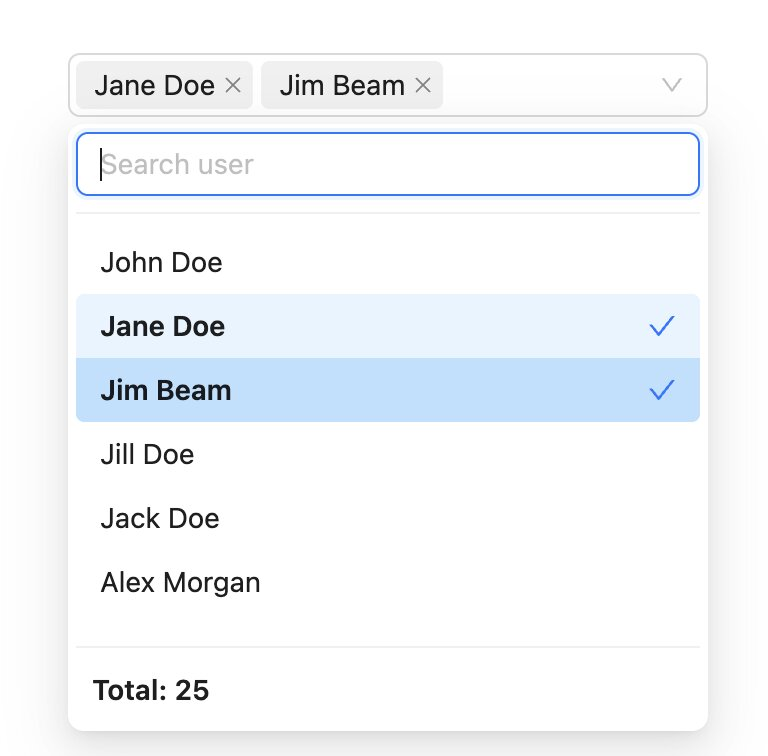

# Ant Design — Dynamic Select

Guide for using `@zealamic/react-dynamic-select/antd` with [Ant Design Select](https://ant.design/components/select).

## Installation

```bash
pnpm add @zealamic/react-dynamic-select antd
```

Peer dependencies: `react >= 19`, `antd >= 5`.

## Import

```tsx
import {
  AntdDynamicSelect,
  useAntdDynamicSelect,
  SEARCH_PLACEMENT,
  LOAD_MORE_TYPE,
  FETCH_TRIGGER,
} from "@zealamic/react-dynamic-select/antd";
```

## Quick start

```tsx
import { AntdDynamicSelect } from "@zealamic/react-dynamic-select/antd";
import type { AntdDynamicSelectConfig } from "@zealamic/react-dynamic-select/antd";

type User = { id: number; fullName: string };
type ApiParams = { page?: number; pageSize?: number; search?: string };
type ApiResponse = { data: User[]; total: number };

const userListConfig = {
  api: {
    fetch: (params) => fetchUsers(params),
    params: { page: 1, pageSize: 10, search: "" },
  },
  list: { path: "data" },
  total: { path: "total" },
  option: {
    template: { label: "fullName", value: "id" },
  },
} satisfies AntdDynamicSelectConfig<User, ApiResponse, ApiParams>;

function UserSelect() {
  return (
    <AntdDynamicSelect
      placeholder="Select a user"
      style={{ width: 320 }}
      allowClear
      showSearch
      dynamicConfig={userListConfig}
    />
  );
}
```



`AntdDynamicSelect` extends all Ant Design `Select` props and adds `dynamicConfig`.

## Value

- **Single:** `string | number | null` (the `option.template.value` field, e.g. `id`)
- **Multiple:** `mode="multiple"` → array of ids
- Supports Ant Design `labelInValue`

## `dynamicConfig`

Config is merged with `defaultDynamicSelectConfig`. Only pass fields that differ from the defaults.

### `api`

| Field | Description |
|---|---|
| `fetch` | `(params) => Promise<ApiResponse>` — called when opening the dropdown, searching, or loading more |
| `params` | Default query: `page`, `pageSize` (or `limit`), `search` |
| `trigger` | `FETCH_TRIGGER.OPEN` (default) or `FETCH_TRIGGER.MOUNT` |
| `onSuccess` / `onError` | Callbacks after each request |

### `list` / `total` / `option`

| Field | Description |
|---|---|
| `list.path` | Path to the array in the response, e.g. `"data"` or `"result.items"` |
| `total.path` | Path to the total record count, e.g. `"total"` |
| `total.label` | Footer label, defaults to `"Total"` |
| `option.template.label` | Label field or template, supports `"{firstName} {lastName}"` |
| `option.template.value` | Value field |

### `search`

| Field | Description |
|---|---|
| `placement` | `SEARCH_PLACEMENT.MENU` (default) or `SEARCH_PLACEMENT.INLINE` |
| `debounce` | Milliseconds, defaults to `500` |
| `inputSearchMenuProps` | Ant Design `Input` props for the menu search field |

**Menu search** (default): search input inside the dropdown.

**Inline search:** set `placement: SEARCH_PLACEMENT.INLINE` and enable `showSearch` on the Select:

```tsx
<AntdDynamicSelect
  showSearch
  allowClear
  dynamicConfig={{
    ...userListConfig,
    search: { placement: SEARCH_PLACEMENT.INLINE },
  }}
/>
```



### `loadMore`

`true` or an object:

| Field | Description |
|---|---|
| `type` | `LOAD_MORE_TYPE.SCROLL` (default) or `LOAD_MORE_TYPE.CLICK` |
| `label` / `loadingLabel` | Button text / loading state text |
| `threshold` / `distance` / `debounce` | Scroll detection tuning |
| `afterFetch` | Hook called after each fetch |

```tsx
// Load more on scroll
dynamicConfig={{ ...config, loadMore: { type: LOAD_MORE_TYPE.SCROLL } }}

// Load more on button click
dynamicConfig={{ ...config, loadMore: { type: LOAD_MORE_TYPE.CLICK } }}
```





### `currentData`

Use when the form already has a value (edit mode) but the option is not in the fetched list:

```tsx
<AntdDynamicSelect
  defaultValue={presetUser.id}
  showSearch
  allowClear
  dynamicConfig={{
    ...userListConfig,
    currentData: presetUser, // or an array for multiple
  }}
/>
```

## Multiple selection

```tsx
<AntdDynamicSelect
  mode="multiple"
  showSearch
  allowClear
  dynamicConfig={userListConfig}
/>
```



## React Hook Form

```tsx
import { Controller, useForm } from "react-hook-form";
import { AntdDynamicSelect } from "@zealamic/react-dynamic-select/antd";

type FormValues = { user: number | null };

function Form() {
  const { control } = useForm<FormValues>({ defaultValues: { user: null } });

  return (
    <Controller
      name="user"
      control={control}
      rules={{ required: "Please select a user" }}
      render={({ field }) => (
        <AntdDynamicSelect
          showSearch
          allowClear
          style={{ width: "100%" }}
          dynamicConfig={userListConfig}
          value={field.value}
          onChange={(value) => field.onChange(value ?? null)}
        />
      )}
    />
  );
}
```

## Hook `useAntdDynamicSelect`

Use when building a custom UI on top of Ant Design `Select`:

```tsx
const selectProps = useAntdDynamicSelect(props);

// Also returns: options, loading, totalNumber, isLoadingMore,
// canLoadMore, loadMoreConfig, handleOpenChange, handlePopupScroll,
// handleLoadMoreClick, searchValue, handleInlineSearch, handleMenuSearchChange
```

## Notes

- For **inline search**, `showSearch={true}` is required.
- Closing the dropdown resets the search value and re-fetches the first page (if a search was active).
- `listHeight` defaults to `200` when not provided.
- Fetch runs only on the first open (unless `trigger: FETCH_TRIGGER.MOUNT`).

---

## Preview


