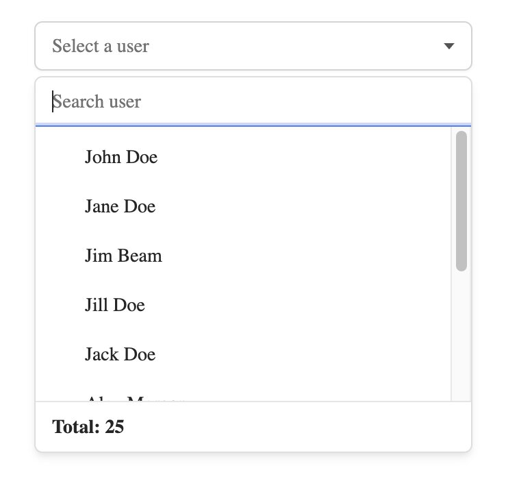
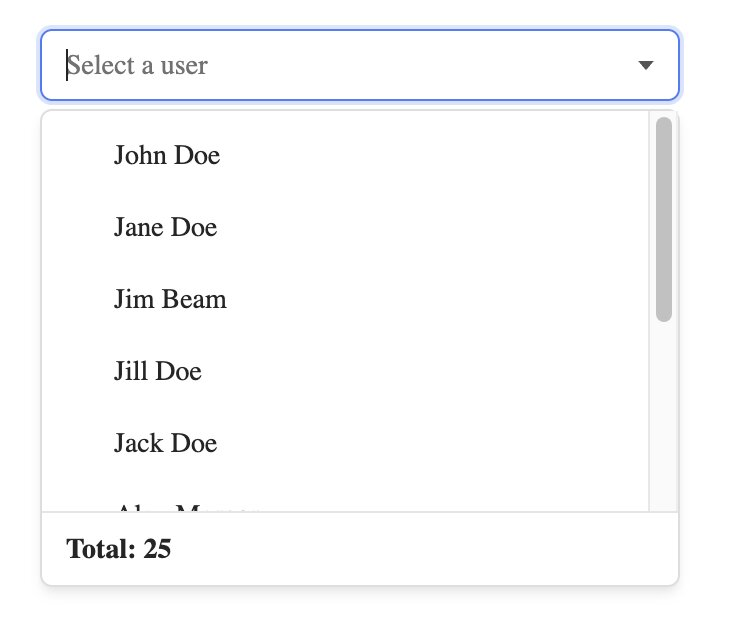
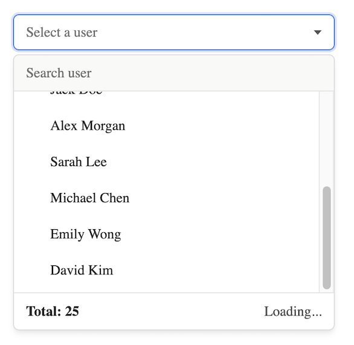
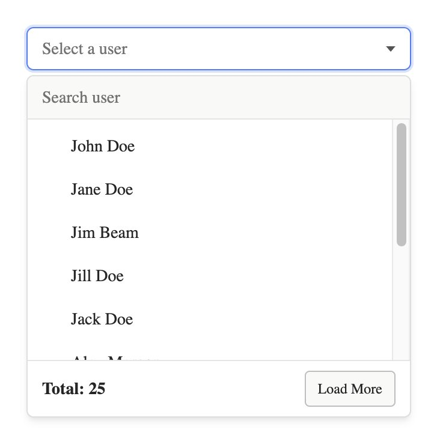
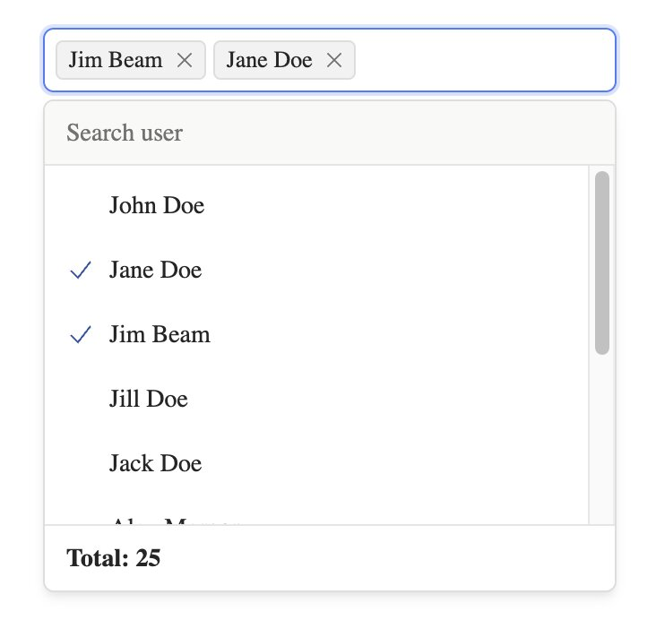

# Base UI — Dynamic Select

Guide for using `@zealamic/react-dynamic-select/base-ui` with [@base-ui/react Combobox](https://base-ui.com/react/components/combobox).

The Base UI variant is **headless**: fetch/search/load-more logic is built in; you provide the UI via `components` and `icons`.

## Installation

```bash
pnpm add @zealamic/react-dynamic-select @base-ui/react
```

Peer dependencies: `react >= 19`, `@base-ui/react >= 1`.

## Import

```tsx
import {
  BaseUiDynamicSelect,
  useBaseUiDynamicSelect,
  getOptionLabel,
  isOptionEqualToValue,
  itemToStringLabel,
  itemToStringValue,
  SEARCH_PLACEMENT,
  LOAD_MORE_TYPE,
  FETCH_TRIGGER,
} from "@zealamic/react-dynamic-select/base-ui";
```

## Quick start

`BaseUiDynamicSelect` **requires** a `components` prop to render UI. The library ships internal defaults without styles — see Storybook (`stories/components/base-ui/`) for a reference implementation.

```tsx
import { BaseUiDynamicSelect } from "@zealamic/react-dynamic-select/base-ui";
import type { BaseUiDynamicSelectConfig } from "@zealamic/react-dynamic-select/base-ui";
import { createBaseUiStoryComponents } from "./your-components"; // create based on Storybook example

const components = createBaseUiStoryComponents();

const userListConfig = {
  api: {
    fetch: fetchUsers,
    trigger: FETCH_TRIGGER.OPEN,
    params: { page: 1, pageSize: 10, search: "" },
  },
  list: { path: "data" },
  total: { path: "total" },
  option: {
    template: { label: "fullName", value: "id" },
  },
} satisfies BaseUiDynamicSelectConfig;

function UserSelect() {
  return (
    <BaseUiDynamicSelect
      placeholder="Select a user"
      components={components}
      listHeight={200}
      dynamicConfig={userListConfig}
    />
  );
}
```



## Value

Unlike Ant Design/MUI, the value is an **option object**, not a primitive:

- **Single:** `ResolvedOption | null` → `{ label: string, value: string | number }`
- **Multiple:** `multiple={true}` → `ResolvedOption[]`

```tsx
import type { ResolvedOption } from "@zealamic/react-dynamic-select";

const [user, setUser] = useState<ResolvedOption | null>(null);

<BaseUiDynamicSelect
  value={user}
  onValueChange={(value) => setUser(value as ResolvedOption | null)}
  components={components}
  dynamicConfig={userListConfig}
/>
```

Helpers:

```tsx
getOptionLabel(option);      // display label
isOptionEqualToValue(a, b);  // compare by value
itemToStringLabel(option);   // for Combobox itemToStringLabel
itemToStringValue(option);   // for Combobox itemToStringValue
```

## `components` — slot system

Each slot is a React component that replaces a Combobox part:

| Slot | Description |
|---|---|
| `Root`, `Label`, `Input`, `InputGroup` | Main chrome |
| `Trigger`, `Icon`, `Clear` | Open/clear controls |
| `Portal`, `Positioner`, `Popup`, `List` | Dropdown |
| `Item`, `ItemText`, `ItemIndicator` | Option row |
| `MenuSearchInput` | Menu search (`SEARCH_PLACEMENT.MENU`) |
| `Status`, `Empty`, `LoadingOverlay` | Loading / empty states |
| `ListFooter` | Total count + load more button |
| `Button`, `Separator` | Action button, divider |
| `Chips`, `Chip`, `ChipRemove`, `Value` | Multiple mode |

**Primitive slots** accept the same props as Base UI Combobox.

**Enriched slots** add extra context:

```tsx
// Item — includes option
({ option, ...props }) => <Combobox.Item {...props} />

// MenuSearchInput — includes searchValue, onSearchChange
({ searchValue, onSearchChange, ...props }) => (...)

// ListFooter — total, load more state
({ totalNumber, canLoadMore, onLoadMoreClick, loadMoreConfig, ...props }) => (...)
```

## `icons`

Customize the default SVG icons:

```tsx
<BaseUiDynamicSelect
  icons={{
    Check: MyCheckIcon,
    Clear: MyClearIcon,
    CaretDown: MyCaretIcon,
  }}
  components={components}
  dynamicConfig={userListConfig}
/>
```

## `dynamicConfig`

Shared API. `search.inputSearchMenuProps` accepts `ComboboxInputProps`.

See [ANTD.md](./ANTD.md#dynamicconfig) for details on `api`, `list`, `total`, `option`, `loadMore`, and `currentData`.

### Search

```tsx
// Menu search (default)
search: {
  placement: SEARCH_PLACEMENT.MENU,
  inputSearchMenuProps: { placeholder: "Search user" },
}

// Inline search — type directly in the main input
search: {
  placement: SEARCH_PLACEMENT.INLINE,
  debounce: 300,
}
```



### Load more

```tsx
loadMore: { type: LOAD_MORE_TYPE.SCROLL }  // default
loadMore: { type: LOAD_MORE_TYPE.CLICK }
```





## Multiple selection

```tsx
<BaseUiDynamicSelect
  multiple
  placeholder="Select users"
  components={createBaseUiStoryComponents({ multiple: true })}
  dynamicConfig={userListConfig}
/>
```



## Pre-loaded value

```tsx
const presetUser = { id: 15, fullName: "Emma Johnson", ... };

<BaseUiDynamicSelect
  defaultValue={{ label: presetUser.fullName, value: presetUser.id }}
  dynamicConfig={{
    ...userListConfig,
    currentData: presetUser,
  }}
  components={components}
/>
```

## React Hook Form

Value type is `ResolvedOption | null`:

```tsx
import { useMemo } from "react";
import { Controller, useForm } from "react-hook-form";
import type { ResolvedOption } from "@zealamic/react-dynamic-select";
import { BaseUiDynamicSelect } from "@zealamic/react-dynamic-select/base-ui";

type FormValues = { user: ResolvedOption | null };

function Form() {
  const { control } = useForm<FormValues>({ defaultValues: { user: null } });
  const components = useMemo(() => createBaseUiStoryComponents(), []);

  return (
    <Controller
      name="user"
      control={control}
      rules={{ required: "Please select a user" }}
      render={({ field }) => (
        <BaseUiDynamicSelect
          placeholder="Select a user"
          components={components}
          listHeight={200}
          dynamicConfig={userListConfig}
          value={field.value}
          onValueChange={(value) => field.onChange(value)}
        />
      )}
    />
  );
}
```

## Hook `useBaseUiDynamicSelect`

```tsx
const hookReturn = useBaseUiDynamicSelect(props);
// Returns: options, loading, open, handleOpenChange,
// handlePopupScroll, handleLoadMoreClick, searchValue, ...
```

Use when building a fully custom UI from the hook.

## TypeScript generics

```tsx
BaseUiDynamicSelect<UserModel, ApiResponse, ApiParams, Multiple>
```

- `DataType` — item type in `currentData`
- `ApiResponse` — API response type
- `ApiParams` — query params type (must include `search?: string`)
- `Multiple` — `true` | `false`

## Notes

- You **must** pass styled `components` — the built-in defaults have no CSS.
- See `stories/components/base-ui/story-components.tsx` and `base-ui.module.css` to copy the pattern.
- Use `onValueChange(value, eventDetails)` instead of `onChange` from other variants.
- The `label` prop renders a label above the input when `components.Label` is provided.
