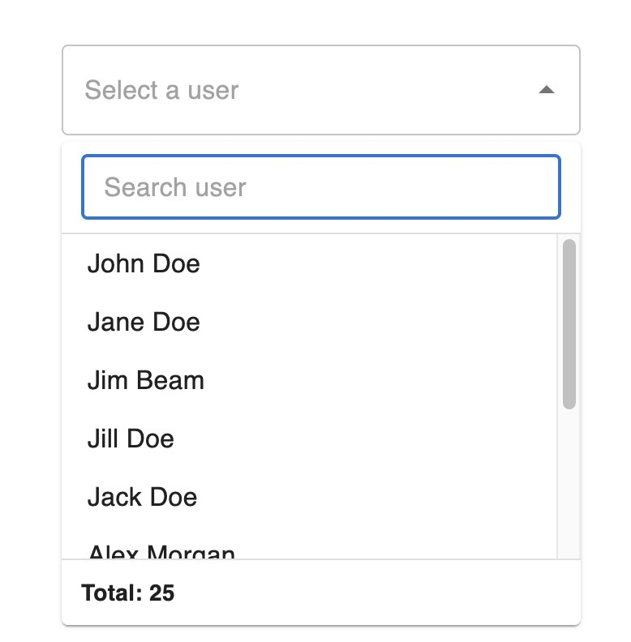
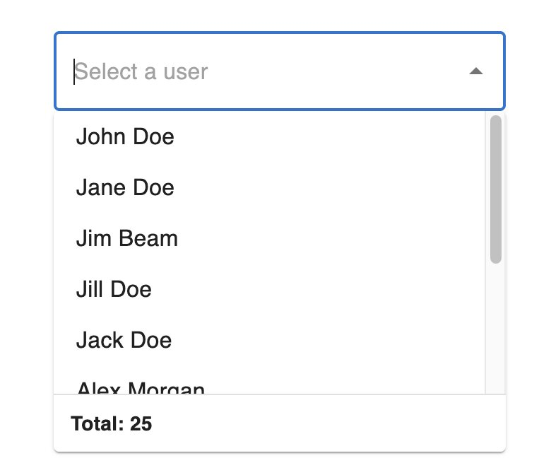
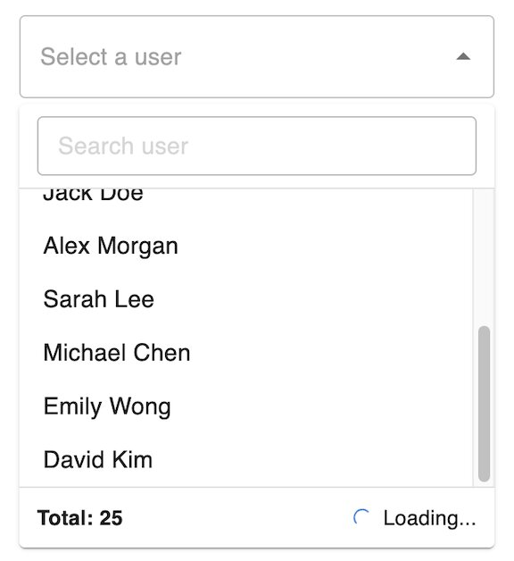
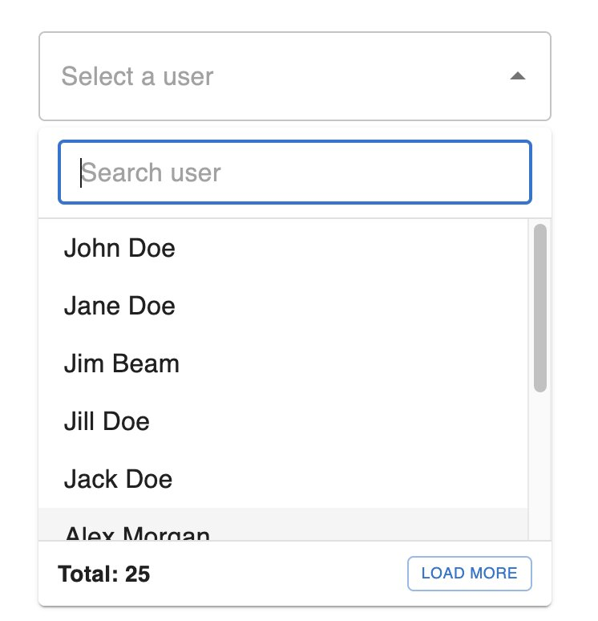
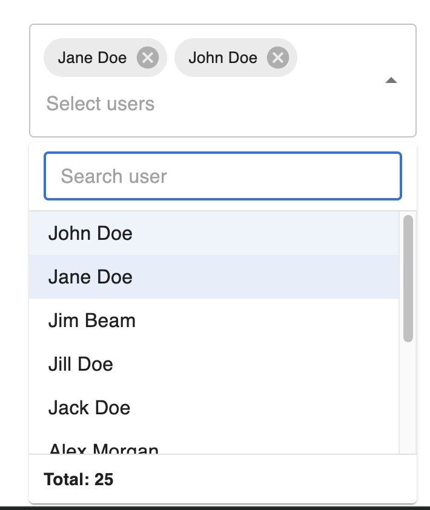

# MUI — Dynamic Select

Guide for using `@zealamic/react-dynamic-select/mui` with [MUI Autocomplete](https://mui.com/material-ui/react-autocomplete/).

## Installation

```bash
pnpm add @zealamic/react-dynamic-select @mui/material @emotion/react @emotion/styled
```

Peer dependencies: `react >= 19`, `@mui/material >= 5`.

## Import

```tsx
import {
  MuiDynamicSelect,
  useMuiDynamicSelect,
  SEARCH_PLACEMENT,
  LOAD_MORE_TYPE,
  FETCH_TRIGGER,
} from "@zealamic/react-dynamic-select/mui";
```

## Quick start

```tsx
import { MuiDynamicSelect } from "@zealamic/react-dynamic-select/mui";
import type { MuiDynamicSelectConfig } from "@zealamic/react-dynamic-select/mui";

type User = { id: number; fullName: string };
type ApiParams = { page?: number; pageSize?: number; search?: string };
type ApiResponse = { data: User[]; total: number };

const userListConfig = {
  api: {
    fetch: fetchUsers,
    params: { page: 1, pageSize: 10, search: "" },
  },
  list: { path: "data" },
  total: { path: "total" },
  option: {
    template: { label: "fullName", value: "id" },
  },
} satisfies MuiDynamicSelectConfig<User, ApiResponse, ApiParams>;

function UserSelect() {
  return (
    <MuiDynamicSelect
      placeholder="Select a user"
      sx={{ width: 320 }}
      dynamicConfig={userListConfig}
    />
  );
}
```



`MuiDynamicSelect` wraps MUI `Autocomplete` with an async data layer. Most Autocomplete props are supported, except `options`, `value`, `defaultValue`, `onChange`, `filterOptions`, and `renderInput` (managed internally).

## Value

Type `MuiDynamicSelectValue`:

- **Single:** `string | number | null` (primitive id)
- **Multiple:** `Array<string | number>`

The component maps primitives ↔ internal `ResolvedOption` objects automatically.

```tsx
// Controlled
const [userId, setUserId] = useState<number | null>(null);

<MuiDynamicSelect
  value={userId}
  onChange={(_event, value) => {
    setUserId(value == null || Array.isArray(value) ? null : value);
  }}
  dynamicConfig={userListConfig}
/>
```

## `dynamicConfig`

Same structure as the Ant Design variant. See [ANTD.md](./ANTD.md#dynamicconfig) for details on `api`, `list`, `total`, `option`, `loadMore`, and `currentData`.

The only difference: `search.inputSearchMenuProps` accepts MUI `TextField` props.

### Search

**Menu search** (default): search input inside the popup Paper.

**Inline search:**

```tsx
<MuiDynamicSelect
  dynamicConfig={{
    ...userListConfig,
    search: {
      placement: SEARCH_PLACEMENT.INLINE,
      debounce: 300,
    },
  }}
/>
```



### Load more

```tsx
// Scroll (default)
loadMore: { type: LOAD_MORE_TYPE.SCROLL }

// Click
loadMore: { type: LOAD_MORE_TYPE.CLICK }
```





## Multiple selection

```tsx
<MuiDynamicSelect
  multiple
  placeholder="Select users"
  sx={{ width: 320 }}
  dynamicConfig={userListConfig}
/>
```



## Pre-loaded value (`currentData`)

```tsx
<MuiDynamicSelect
  defaultValue={presetUser.id}
  dynamicConfig={{
    ...userListConfig,
    currentData: presetUser,
  }}
/>

// Multiple
<MuiDynamicSelect
  multiple
  defaultValue={[user1.id, user2.id]}
  dynamicConfig={{
    ...userListConfig,
    currentData: [user1, user2],
  }}
/>
```

## Additional props

| Prop | Description |
|---|---|
| `placeholder` | TextField placeholder |
| `label` | TextField label |
| `listHeight` | Listbox height, defaults to `200` |
| `helperText` / `error` / `required` / `name` | From MUI TextField |
| `renderInput` | Customize the TextField |
| `renderValue` | Customize multiple-mode chip display |

## React Hook Form

```tsx
import { Controller, useForm } from "react-hook-form";
import { MuiDynamicSelect } from "@zealamic/react-dynamic-select/mui";

type FormValues = { user: number | null };

function Form() {
  const { control } = useForm<FormValues>({ defaultValues: { user: null } });

  return (
    <Controller
      name="user"
      control={control}
      rules={{ required: "Please select a user" }}
      render={({ field }) => (
        <MuiDynamicSelect
          sx={{ width: "100%" }}
          placeholder="Select a user"
          dynamicConfig={userListConfig}
          value={field.value}
          onChange={(_event, value) => {
            field.onChange(
              value == null || Array.isArray(value) ? null : value,
            );
          }}
        />
      )}
    />
  );
}
```

## Hook `useMuiDynamicSelect`

```tsx
const hookReturn = useMuiDynamicSelect(props);
// Returns: options, loading, isOpen, handleOpen, handleClose,
// handlePopupScroll, handleLoadMoreClick, searchValue, ...
```

Use when rendering a custom UI on top of MUI Autocomplete.

## Notes

- Client-side filtering is disabled (`filterOptions` always returns all server-fetched options).
- Loading is shown via `CircularProgress` in the input and an overlay in the popup.
- Closing the popup resets search, same as the Ant Design variant.
